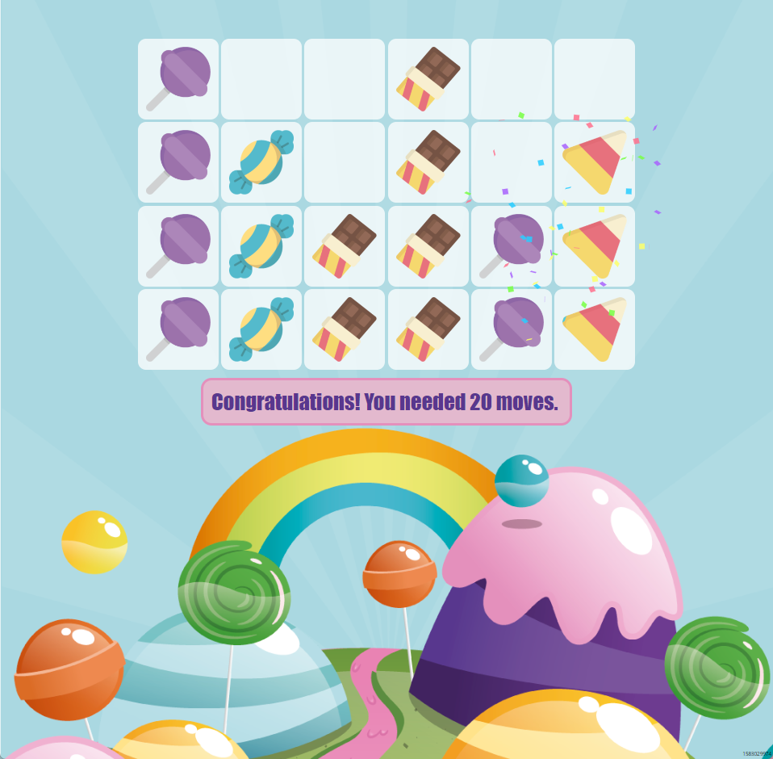
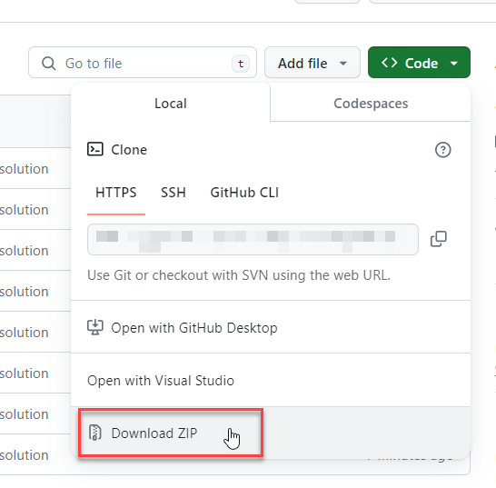

# Christmas Queue

## Introduction

Learning about dynamic data structures like lists, stacks, or queues does not need to be boring. It can be quite a bit of fun. In this assignment, you will be creating a game that uses a stack and a list. The game is called Christmas Queue. You start with multiple stacks of sweet presents. Your job is to move sweets around until every stack contains a single kind of sweet. You can only take out sweets from the top of the stack (well, graphically the bottom, but logically the top). You can only put sweets on top of a stack. Your goal is to sort the sweets with as few moves as possible.

Want to try it? [Here you can try the finished game.](https://christmasqueue.z6.web.core.windows.net/?rows=4&columns=4)

## Tipps for Playing the Game

* If you start the game without query string parameters, you will get a 8 columns and 5 rows. Example URL: [https://christmasqueue.z6.web.core.windows.net/](https://christmasqueue.z6.web.core.windows.net/)
* You can specify rows and columns in the URL. Example URL: [https://christmasqueue.z6.web.core.windows.net/?rows=4&columns=4](https://christmasqueue.z6.web.core.windows.net/?rows=4&columns=4)
* Do you want to challenge a friend? In the right lower corner of the game, you can find a _seed_ value. By putting the seed value in the URL, other people can play the same game. You can compare the number of moves it took you to solve the game. Example URL: [https://christmasqueue.z6.web.core.windows.net/?rows=4&columns=4&seed=214450712](https://christmasqueue.z6.web.core.windows.net/?rows=4&columns=4&seed=214450712)

## Your Job

The game's user interface is already implemented. It is your job to implement the data structures holding the game's data.

> **Note:** This exercise does **not** use the optimal data structures for this kind of game. However, we want to practice dynamic data structures and therefore, the games uses a stack and a list.

Your first task is to complete the implementation of the [`Stack` class](./ChristmasQueue.Collections/Stack.cs). The code contains detailed descriptions of what the methods must do.

Next, you must implement the [`ListOfStacks` class](./ChristmasQueue.Collections/List.cs). Again, the code contains detailed descriptions of what the methods must do.

Rules of the exercise:

1. You **must not** change the method signatures.
2. You **must** use all of the given classes, properties, constructors, and methods.
3. You **can** add additional classes, properties, constructors, and methods.
4. You **must** implement all methods, constructors, and properties that contain a `TODO` comment.

## Automated Unit Tests

To check your implementation, you can run the [unit tests](./ChristmasQueue.Collections.Tests/) included in the solution. _Unit tests_ are automated tests that check if your code works as expected. Up until now, we always tested our code manually. Now it is time that you learn how to automate this process.

You can run the tests by executing `dotnet test` in the solution's root folder. The tests will run and show you the results. Once all tests are successfull, you have completed the assignment and you can try the game.

An alternative to `dotnet test` is the [_Test Explorer_ extension in VSCode](https://marketplace.visualstudio.com/items?itemName=formulahendry.dotnet-test-explorer).

## Starting the Game

You start the game in the same way that you start a console app. Simply run `dotnet run --project ChristmasQueue` in the solution's root folder. You will be given a URL in the console output. Open the URL in your browser and you can start playing.

## Getting Started

If you already know how to work with Git and GitHub, then you can clone this repository and start working on the assignment.

If you are new to Git and GitHub, then you can download the repository as a ZIP file. To do so, click on the green _Code_ button and select _Download ZIP_.

Once you are done, upload the `Stack.cs` and `List.cs` files to your GitHub repository.
